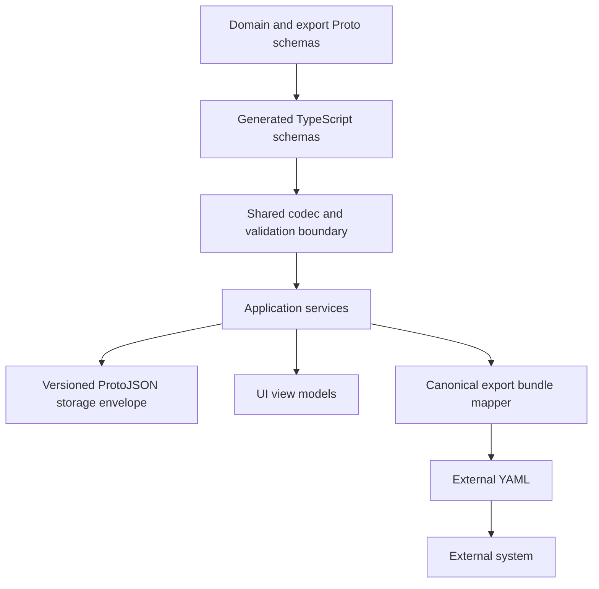
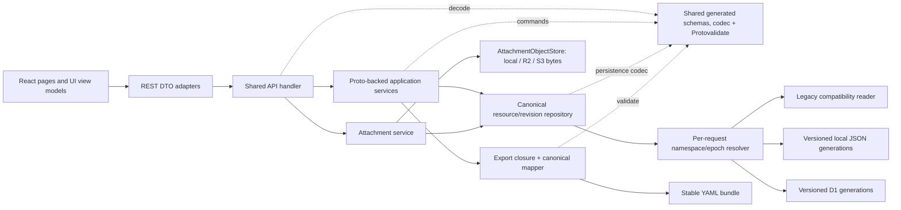

# Proto-First Runtime and YAML Export - Plan

## Goal Capsule

- **Objective:** Make Proto the single authoritative SOP domain contract, migrate the application without regressing current page behavior, and publish a stable export-only YAML bundle for external systems.
- **Authority order:** Product Contract requirements and acceptance examples → confirmed Planning Contract decisions → repository conventions. YAML and the legacy TypeScript model never override Proto domain semantics.
- **Execution profile:** Deep, characterization-first, reversible data migration. Establish behavior tests before replacing runtime/storage paths; then use Expand → Migrate → Contract.
- **Stop conditions:** Stop the cutover if any live field lacks an explicit Proto/UI-only classification, any legacy reference is missing or ambiguous, canonical data fails validation/reconciliation, attachment ownership is uncertain, or the generated/runtime stack fails in Cloudflare Pages.
- **Tail ownership:** The executor owns generated-code drift checks, local JSON and D1 migration/rollback tooling, complete automated regression coverage, migration reports, documentation, and removal of superseded adapters after the contract gate passes.

---

## Product Contract

### Summary

The implementation will complete the Proto model for all current domain behavior, introduce generated Proto types behind the existing API and storage seams, migrate persisted data through a reversible versioned cutover, and retain all current page workflows under characterization-first E2E coverage. A separate canonical YAML bundle will export confirmed snapshots with source identities without making YAML an internal model.

### Problem Frame

The repository already defines a normalized Proto model, but the frontend, server, storage adapters, versioning logic, and YAML exporter still use a separate handwritten TypeScript/JSON model. The current exporter manually assembles a legacy YAML shape, derives identifiers, localizes protocol values, and resolves task SOPs through names and version strings. Continuing this arrangement would leave Proto, runtime types, persisted data, and exported YAML free to drift independently.

Repository research also found that the current Proto baseline does not yet represent every field used by the working UI. Making it authoritative without first closing those gaps would contradict the requirement to preserve current page operations and could silently discard data.

### Product Contract Preservation Note

The previously confirmed Product Contract is unchanged except for R7, which was clarified after flow analysis and user confirmation: all addressable resources have logical source identity, while only revisioned snapshots can truthfully have revision identity. R20-R24 record the subsequently confirmed page-parity, migration, RobotModel revision, and attachment-retention requirements. R25 records the later confirmed rule that all mutable catalog content needed by export is frozen at confirmation.

### Key Decisions

- **Proto is the only internal domain authority.** Domain field meaning, lifecycle, references, revisions, presence, and structural validation originate in Proto rather than YAML or handwritten TypeScript interfaces.
- **YAML is an export boundary, not a runtime or persistence model.** Internal logic operates on generated types, while versioned ProtoJSON remains the initial persistence representation behind existing storage seams.
- **The export bundle is purpose-built but derived.** Its external shape is stable and understandable without Proto knowledge, while its business content is derived from the same domain messages rather than becoming a second independent domain schema.
- **Exports distinguish logical resources from revisions.** Every independently addressable resource carries its canonical resource name and immutable UID; immutable revision entries additionally carry revision name and human-facing version label.
- **Future imports create copies.** Exported identity is provenance and lookup data, not authority to overwrite a resource if import support is added later.



### Actors

- A1. **SOP operator:** Uses the current pages to maintain master data, requirements, task SOPs, revisions, and attachments, and exports confirmed snapshots.
- A2. **SOP service:** Validates Proto-backed resources, resolves immutable references, persists normalized data, and produces exports.
- A3. **External system:** Parses the documented YAML contract and uses exported source identities to query or correlate data in the originating system.
- A4. **Operator/deployer:** Runs migration preflight and blocks activation when reconciliation fails; after activation, rolls back the marker plus known-good compatibility build only if read-only validation fails before writes reopen.

### Requirements

**Internal model and persistence**

- R1. Proto must be the single authoritative definition of domain resources, lifecycle semantics, references, revisions, presence, and structural validation.
- R2. Frontend and backend domain behavior must use generated Proto TypeScript types or thin application views derived from them rather than a parallel handwritten domain model.
- R3. Persistence must store a normalized representation of the Proto-backed resources and revisions; YAML must not become an internal source of truth.
- R4. Existing JSON and D1 storage mechanisms may remain during migration if their stored values and interfaces move to the normalized resource model.

**External YAML bundle**

- R5. The system must export a versioned, self-contained domain snapshot bundle containing the selected confirmed snapshot and every pinned TaskSop and RobotModel snapshot required to interpret it; attachment bytes remain external HTTPS dependencies.
- R6. The bundle must contain only the effective snapshots needed for the export and must not include the full revision history.
- R7. Every independently addressable exported resource must include `resource_name` and `uid`; every revisioned snapshot must additionally include `revision_name` and `version_label` as stable source identity and traceability fields.
- R8. The bundle must omit concurrency and server-operation metadata, including `etag`, that does not provide stable external identity.
- R9. References within the bundle must remain resolvable from bundle content while preserving source resource and revision identities for external lookup.
- R10. The YAML contract must be usable from its own documentation and schema version without requiring the external consumer to understand Proto or generated SDKs.
- R11. The YAML encoding must define canonical field names, enum tokens, dates, durations, omitted values, ordering expectations, and unknown-field behavior.
- R12. Exporting the same immutable revision must produce semantically and byte equivalent YAML for the same exporter version; volatile export timestamps and bundle instance IDs are omitted.

**Attachments and external links**

- R13. Attachments must be represented by public HTTPS URIs rather than embedded data or files bundled beside the YAML.
- R14. Attachment entries should retain available media type, size, and checksum metadata so consumers can assess content without changing URI semantics.
- R15. Export and future import processing must treat attachment URIs as data and must not make server-side requests to validate or fetch arbitrary domains.

**Compatibility with a future import capability**

- R16. The first delivery must not implement YAML import, conflict resolution, rollback, or resource creation from YAML.
- R17. The export contract must distinguish bundle-local references from source-system identity so a future importer can create independent resources and remap their references.
- R18. Source `resource_name`, `uid`, and revision identity must be treated as provenance on future imports and must never imply automatic overwrite authority.
- R19. Any future bundle import must be able to use all-or-nothing validation and creation without requiring a breaking redesign of the export envelope.

**Behavior preservation and migration safety**

- R20. All current page operations must remain available: auth lock/unlock and refresh; navigation/search/list behavior; customer, material, robot, global-field, scene, TaskSop, and Requirement editing; version lifecycle; attachments/images; Requirement ↔ TaskSop navigation; YAML and PDF operations.
- R21. Saving a RobotModel must create a new immutable current RobotModelRevision without adding a separate user-visible publish workflow. A Requirement pins the current revision when selected/saved, and later RobotModel edits must not change the pinned snapshot.
- R22. Legacy local JSON and D1 data must migrate deterministically into a separate versioned namespace, validate and reconcile before activation, and retain untouched legacy data for rollback. Activation must use a drained, write-frozen source point; missing or ambiguous references must fail closed and produce an actionable report.
- R23. Attachment metadata and managed bytes referenced by an immutable confirmed revision or rollback-eligible namespace must remain available even when a later draft removes that attachment; cleanup may delete only proven-unreferenced draft/aborted artifacts after retention expires. External HTTPS content is never owned or deleted by the service.
- R24. Existing REST paths and user-visible interaction semantics remain stable during migration except for explicitly required corrections, including refusing YAML export for drafts.
- R25. Confirmation must freeze every mutable Customer, Material, Scene, GlobalField, MaterialStateRule, Attachment-metadata, and other catalog value needed to interpret or export that revision; later catalog edits must not change repeated export of the confirmed revision.

### Key Flows

- F1. **Confirmed snapshot export:** A1 selects a confirmed Requirement or TaskSop revision. A2 validates it, resolves the root-specific dependency closure, canonicalizes the bundle, and returns deterministic YAML. Requirement roots include their pinned RobotModelRevision and TaskSopRevisions; standalone TaskSop roots include only the task snapshot plus referenced catalog/attachment entries unless an explicit robot revision reference exists.
- F2. **Storage migration and cutover:** While legacy writes remain active, A4 fingerprints the source, converts records into an inactive versioned generation, and reviews collisions, unresolved references, and per-record semantic reconciliation. Cutover then drains requests, freezes writes, rechecks the source fingerprint, and compare-and-swaps one active-version marker. The system stays read-only through canonical boot/read/reference/download/export smoke validation; marker rollback and the known-good compatibility build are allowed only before writes reopen. After reopening, recovery is forward on canonical storage.
- F3. **RobotModel save and pin:** A1 saves a RobotModel; A2 writes the updated logical resource and a new immutable revision together. A Requirement draft pins the selected current revision, and confirmation retains that exact revision thereafter.
- F4. **TaskSop lifecycle:** A1 creates or edits a draft, manages all editor sections and attachments, confirms it into an immutable revision, views it read-only, creates a new patch draft, exports confirmed YAML/PDF, and deletes only deletable drafts.
- F5. **Requirement lifecycle:** A1 edits all requirement sections and production items, selects and opens pinned TaskSop revisions, returns with the selection intact, is blocked from confirmation/export when dependencies are missing or unconfirmed, confirms, creates a follow-up draft, and exports confirmed YAML/PDF.
- F6. **Attachment lifecycle:** A1 uploads, previews/downloads, removes, or aborts an attachment/image operation. A2 maintains immutable metadata and does not remove bytes still referenced by confirmed revisions.
- F7. **Authenticated page session:** A1 unlocks the app, navigates all six top-level page groups, refreshes without losing valid auth or persisted mutations, and can lock/re-enter according to current behavior.

### Acceptance Examples

- AE1. **Confirmed Requirement closure.** Given a confirmed Requirement pinned to one TaskSopRevision and one RobotModelRevision, export contains all three exact snapshots and no older revisions.
- AE2. **Draft export rejection.** Given a draft Requirement or TaskSop, YAML export is refused and YAML is never used as draft persistence.
- AE3. **Traceability.** An external consumer can correlate any logical resource through `resource_name` and `uid`, and any immutable snapshot through `revision_name` and `version_label`.
- AE4. **Arbitrary public attachment.** An attachment on an arbitrary HTTPS domain is preserved with known metadata and no DNS/HTTP request; a referenced missing or non-HTTPS URI fails export with actionable validation.
- AE5. **Future copy import.** A future importer can generate new internal names, UIDs, and revisions while retaining exported identities only as provenance.
- AE6. **No field loss.** Every persisted field exercised by a current editor is either represented in Proto or explicitly classified as transient UI state before conversion; migration reports zero silently dropped fields.
- AE7. **Pinned robot immutability.** Editing a RobotModel after a Requirement pins its revision does not change the Requirement snapshot or repeated export output.
- AE8. **Idempotent migration.** Re-running a completed or partially completed migration produces the same canonical identities/content, skips already valid records, and never activates a partial namespace.
- AE9. **Ambiguous reference.** If a legacy scene/title/version reference resolves to zero or multiple targets, preflight identifies the owning record and candidate targets and cutover remains blocked.
- AE10. **Attachment retention.** Removing an attachment from a new draft does not remove metadata or bytes referenced by its confirmed predecessor; unreferenced aborted uploads can be cleaned safely.
- AE11. **Page parity.** Each current page's navigation, search/list, create/edit, validation, lifecycle, attachment, and export journey succeeds after reload on the Proto-backed implementation.
- AE12. **Canonical YAML.** Repeated export of an immutable revision yields identical UTF-8 YAML with stable ordering, lower-snake-case fields, documented scalars, no aliases/tags, and no `etag`, export timestamp, or full history.
- AE13. **Runtime parity.** Shared generated schemas, ProtoJSON codecs, and Protovalidate rules run successfully in Node/Express and Cloudflare Pages Functions.
- AE14. **Frozen export vocabulary.** Editing any Customer, Material, Scene, global vocabulary, material rule, or attachment metadata after confirmation does not change the confirmed revision's repeated YAML export.

### Success Criteria

- Application domain behavior no longer depends on the legacy nested TypeScript domain model.
- Proto covers every persisted current-page field; UI-only state is isolated in explicitly named view models.
- Local JSON and D1 store the same versioned canonical ProtoJSON envelope and pass migration reconciliation.
- Existing API paths and all current page operations pass the characterization E2E suite after migration.
- An external consumer can implement the YAML contract without Proto and trace every exported resource/snapshot to its source.
- Export-only v1 leaves a compatible path to atomic copy-based import without implementing import now.

### Scope Boundaries

**Deferred for later**

- YAML import, preview-as-import, validation reporting for imported files, conflict handling, transactional creation, and rollback.
- Copy-based identity remapping and provenance persistence during import.
- Publishing JSON Schema or another generated external validator if consumers request it.
- Cross-browser E2E beyond the blocking Chromium project unless a concrete compatibility requirement appears.

**Outside this contract**

- YAML as the application's runtime domain model or primary persistence format.
- Full revision-history backup and restoration through the exchange bundle.
- Embedding attachment bytes or packaging attachment files with YAML.
- Server-side fetching or availability probing of arbitrary attachment URLs.
- Compatibility with legacy YAML document shapes.
- UI redesign, new user-visible RobotModel publishing workflow, or a general REST API redesign.
- Adding optimistic concurrency; the current last-write-wins runtime behavior remains unchanged and `etag` is only excluded from export.
- Live-cloud E2E against production D1/R2 or production data.

### Dependencies and Assumptions

- Node 22 LTS is the development and CI baseline for the selected Protobuf-ES and Playwright toolchain.
- The migration has a controlled cutover window; permanent dual-write is unnecessary and explicitly avoided.
- Current UI behavior is treated as the baseline except where it conflicts with an explicit Product Contract rule, such as confirmed-only YAML export.
- Public attachment retention is an operational responsibility of the configured storage/public URL provider; export validates URI shape without fetching it.

### Sources and Research

- `docs/proto-v1alpha1.md` and `proto/coscene/sop/v1alpha1/` — current resource, revision, validation, and migration decisions.
- `src/types.ts` and `src/App.tsx` — current runtime model and complete UI behavior surface.
- `server/api.ts`, `server/store.ts`, `server/d1Store.ts`, and `schema.sql` — API and persistence seams.
- `server/versioning.ts` and `server/yamlExport.ts` — legacy version/reference and YAML behavior to replace.
- [Buf generation](https://buf.build/docs/generate/), [Buf breaking change detection](https://buf.build/docs/breaking/), and [Proto best practices](https://protobuf.dev/best-practices/dos-donts/) — reproducible code generation and schema compatibility.
- [Protobuf-ES manual](https://github.com/bufbuild/protobuf-es/blob/main/MANUAL.md) and [Protovalidate-ES](https://github.com/bufbuild/protovalidate-es) — schema-driven construction, ProtoJSON, and runtime validation.
- [Cloudflare D1 migrations](https://developers.cloudflare.com/d1/reference/migrations/), [D1 batch](https://developers.cloudflare.com/d1/worker-api/d1-database/#batch), and [D1 Time Travel](https://developers.cloudflare.com/d1/reference/time-travel/) — migration, atomic batch, and rollback constraints.
- [Playwright best practices](https://playwright.dev/docs/best-practices), [test isolation](https://playwright.dev/docs/browser-contexts), and [web server configuration](https://playwright.dev/docs/test-webserver) — behavior-oriented, isolated browser verification.

---

## Planning Contract

### Key Technical Decisions

- KTD1. **Pinned generated toolchain.** Add a checked-in `buf.gen.yaml` v2 using the locally pinned `@bufbuild/protoc-gen-es` and keep `@bufbuild/protobuf` at the identical version. Pin `@bufbuild/protovalidate`; standardize Node 22. Generate TypeScript with imports included into a top-level generated-only directory shared by browser, Node, and Pages, commit the output, and make CI regenerate and fail on drift.
- KTD2. **Proto completeness gate before conversion.** Build a field-by-field ledger from `src/types.ts`, all editor bindings in `src/App.tsx`, data fixtures, API payloads, and the four existing Proto files. Add missing domain messages/fields—at minimum global fields/groups, material-state rules, material size/weight, robot extra topic requirements, requirement attachment/delivery details, ordered/bilingual steps, and legacy attachment/state shapes—or explicitly mark a field transient UI-only. No converter work starts until the ledger has no unclassified persisted field.
- KTD3. **One canonical model with explicit boundaries.** Generated Proto messages are the canonical model. Neutral `shared/` modules own construction, ProtoJSON decode/encode, validation, violation mapping, and transport DTOs. UI view models remain frontend-owned. Legacy persistence decoders and YAML export objects are anti-corruption boundaries; business rules never accept raw YAML or unvalidated generic JSON. The canonical resource/revision repository is separate from the injected `AttachmentObjectStore`, which owns only bytes and multipart operations.
- KTD4. **Versioned ProtoJSON storage and atomic repository contract.** Persist schema version plus canonical resources/revisions, using schema-driven `toJson`/`fromJson`; never `JSON.stringify()` a message directly. ProtoJSON field names become storage compatibility surface and may not be renamed in place. Repository mutations commit whole aggregates: D1 uses one transactional batch, while local storage writes a complete generation to a temporary location and atomically publishes its manifest. One request pins one active namespace/epoch and cannot cross versions mid-operation.
- KTD5. **Expand → Migrate → Contract without permanent dual-write.** First add version-aware readers/codecs while legacy writes remain active. Migration builds and validates an inactive immutable generation. Cutover drains requests, freezes writes, rechecks the source fingerprint, compare-and-swaps the active marker, and keeps the service read-only through canonical boot/read/reference/download/export smoke checks. Marker rollback is lossless only inside that window; after canonical writes reopen, recovery is forward unless a separately designed replay/reverse migration exists. Legacy writers/decoders remain available through the rollback decision window and are removed only after it closes.
- KTD6. **Deterministic identity and reference conversion.** Preserve existing valid source IDs where available. Derive missing UIDs deterministically from resource kind plus stable legacy identity, allocate canonical names from durable IDs rather than display labels, and allocate revision names/version labels deterministically. The converter reports collisions and zero/multiple reference matches and never guesses.
- KTD7. **Transparent RobotModel revisions and atomic confirmation.** Every successful RobotModel save writes the logical resource and one immutable current revision as one repository transaction. Requirement/TaskSop confirmation atomically writes the immutable revision, exact dependency pins, and all frozen catalog/export values. Subsequent master-data edits cannot mutate that snapshot.
- KTD8. **Independent, deterministic YAML contract.** Add an export-bundle Proto as an internal typed mapper contract, but document YAML independently. Use `format: coscene.sop.export`, semantic `schema_version: 1.0.0`, lower-snake-case keys, lower-snake-case enum tokens, RFC 3339 UTC timestamps, `YYYY-MM-DD` dates, ISO 8601 durations, omitted absent optionals, no nulls, and no YAML anchors/custom tags. Preserve semantic list order; sort resource collections and unordered maps by stable identity/key. Unknown fields are rejected by a future first-party importer for the declared major version. Omit volatile envelope fields so immutable exports are byte-stable.
- KTD9. **Root-specific export closure over frozen content.** Requirement export resolves its exact RequirementRevision, RobotModelRevision, TaskSopRevisions, and catalog/attachment values frozen into those immutable snapshots at confirmation. Standalone TaskSop export resolves only its task revision and its frozen explicit dependencies. Export may read current catalogs only for immutable `name`/`uid` identity, never mutable descriptive content. Deduplicate by canonical identity; missing, draft, or conflicting dependencies fail the entire export.
- KTD10. **Reference-safe attachments with delayed physical cleanup.** Canonical storage distinguishes managed `storage_key` objects from external `public_uri` data. Reference mutation and durable cleanup intent commit atomically; an idempotent cleanup worker deletes managed bytes only after zero references across active and rollback-eligible generations plus retention expiry. External HTTPS content is never fetched or deleted. Export requires a public HTTPS URI but never probes it.
- KTD11. **Characterization-first, layered verification.** Use Vitest for codec, validation, converter, store, API, attachment, and YAML contract tests; add a Cloudflare runtime contract project for Functions/D1 boundaries. Use Playwright Chromium for user-visible flows. Browser tests use isolated seeded state, semantic locators, auto-retrying assertions, real downloads, no fixed sleeps, and no real external attachment requests.
- KTD12. **Stable API/UI during internal migration.** Keep existing REST paths and top-level page behavior. Server application services migrate first behind `AppStore`; frontend request/response adapters and explicit view models migrate afterward. The legacy model and adapters are deleted only after the same E2E suite passes on canonical storage.

### High-Level Technical Design

```mermaid
stateDiagram-v2
  [*] --> Expand
  Expand: Generated schemas, codecs, validators, compatibility reader
  Expand --> Preflight: Current behavior tests green
  Preflight: Fingerprint and convert into inactive BUILDING generation
  Preflight --> Blocked: Missing fields, collisions, unresolved refs, invalid records
  Blocked --> Preflight: Correct mappings or source data, then rerun
  Preflight --> Validated: All per-record semantics, identities and refs reconcile
  Validated: Immutable VALIDATED generation; canonical runtime boots explicitly against it
  Validated --> Cutover: Drain requests, freeze writes, recheck source fingerprint, CAS marker
  Cutover: Canonical runtime remains read-only during smoke and E2E
  Cutover --> Rollback: Runtime or E2E gate fails before writes reopen
  Rollback: Restore prior marker and known-good compatibility artifact
  Cutover --> Active: Gates pass and canonical writes reopen
  Active: Marker-only rollback prohibited; recovery is forward
  Active --> Contract: Rollback decision window closes and all gates pass
  Contract: Remove legacy writers/decoder and rerun all gates
  Contract --> [*]
```





### Migration Invariants

- The converter is a pure transformation given legacy data, a fixed clock, and a deterministic identity allocator.
- Each storage envelope has an explicit `storage_schema_version`; SQL migration versions do not substitute for data-format versions.
- Every migration generation has a manifest binding the exact source digest/watermark, converter version, storage/schema/identity versions, expected identity sets and cardinalities, semantic digest, checkpoints, and `BUILDING`/`VALIDATED`/`ACTIVE` state. A changed source or converter starts a fresh generation rather than mutating an old one.
- A rerun against the same source is a no-op for already valid records and produces the same identities, revision graph, frozen catalog content, and export content; unexpected extra/stale rows block validation.
- Reconciliation covers every draft and confirmed record through documented mapping cardinalities and per-record normalized semantic fingerprints, including nested fields, order, presence, attachment metadata/checksums, and reference edges—not only top-level counts.
- D1 aggregate mutations use one transactional batch; local aggregate mutations publish one recoverable generation atomically. Fault injection must never expose half a resource/revision/reference graph.
- Activation uses a drained, write-frozen source point, source-fingerprint recheck, and marker compare-and-swap. Each request pins one namespace/epoch.
- Before remote cutover, record a D1 Time Travel bookmark and retain the known-good compatibility artifact, legacy namespace, and attachment leases through the rollback window. D1 Time Travel is not a backup for R2/S3 bytes.
- Test fixtures and local seeds use the same converter as production migration; replacing seed JSON is not considered a deployed-data migration.

### E2E Behavior Matrix

| Area | Browser-visible journeys that must remain green |
|---|---|
| Auth and shell | Locked state, wrong/right password behavior, unlock, refresh persistence, lock/re-entry, all six navigation destinations |
| Lists | Search/filter, empty/no-match state, open existing record, return to list with persisted mutations |
| Customers | Create and edit customer/contact/notes; reload persistence |
| Materials | Create/edit fields, SKU uniqueness validation, image upload/preview/download/remove, reload persistence |
| Robot models | Create/edit identity and topic constraints; save creates a new revision; an already pinned Requirement remains unchanged |
| Global fields | Create/edit group and field, filter, activate/deactivate, existing internal vocabulary import flow remains unaffected |
| Scenes and TaskSops | Scene create/edit; TaskSop create/edit across materials/objects/states/randomization/collection/annotation/ordered bilingual steps; attachment lifecycle; confirm/read-only/new patch/delete rules; confirmed YAML/PDF download; draft YAML rejection |
| Requirements | Create/edit all sections; production-item add/edit/remove; robot and TaskSop revision selection; open pinned SOP and return; blocked confirm/export for invalid dependencies; confirm/read-only/new draft/delete; attachment lifecycle; YAML preview/copy/download and PDF |
| Downloads | Browser receives non-empty UTF-8 YAML/PDF with expected filename; YAML root/version/source identities parse correctly |

The browser matrix proves user-visible journeys, not every field combination. Converter/Proto/YAML unit and integration suites own exhaustive semantic edge cases.

### System-Wide Impact

- **Data lifecycle:** logical resources, immutable revisions, attachment references, and storage envelopes become explicit. Deletion must check revision reachability.
- **Compatibility:** REST paths remain stable, but persisted blobs and internal TypeScript values change shape. ProtoJSON names are now a compatibility surface.
- **Validation:** Protovalidate runs at request, migration, persistence, and export trust boundaries. Invalid user data is distinct from validator/schema runtime failure.
- **Runtime parity:** shared code must use web-standard/ESM APIs supported by both Node and Cloudflare Pages; protobuf alone does not justify enabling `nodejs_compat`.
- **Operations:** migration preflight, report, switch marker, D1 bookmark, and rollback become explicit deployment steps.
- **Security:** attachment URLs are validated syntactically as HTTPS data and are never fetched by export/tests, preventing SSRF expansion.

### Sequencing Constraints

1. Establish the test harness and characterization baseline before changing domain behavior.
2. Complete the Proto coverage ledger and prove generated runtime compatibility before converting data.
3. Land codecs/validators, repository transaction contract, and deterministic converter before switching any canonical read/write path.
4. Migrate server lifecycle/reference behavior and frozen confirmation snapshots behind the canonical repository; boot it explicitly against the inactive validated generation before activation.
5. Establish attachment ownership, cleanup intent, and rollback-window retention before the YAML exporter consumes attachment metadata.
6. Migrate frontend view models without changing routes, then activate during a drained/read-only gate.
7. Contract/remove legacy code only after the rollback decision window closes; rerun the full suite after removal.

### Risks and Mitigations

- **Silent data loss from incomplete Proto:** blocked by the coverage ledger, fixture round-trip tests, and zero-unclassified-field gate.
- **Identity drift or ambiguous legacy references:** deterministic allocation, explicit alias/provenance maps, collision report, and fail-closed cutover.
- **Acknowledged writes lost during rollback:** drain and freeze writes, pin each request to one epoch, recheck the source fingerprint, allow marker rollback only before writes reopen, and use forward recovery afterward.
- **ProtoJSON breakage on field rename:** Buf breaking checks plus a documented no-in-place-rename rule and explicit storage migrations.
- **Attachment deletion corrupts history or rollback:** durable cleanup intent, managed/external ownership distinction, leases across rollback-eligible generations, delayed idempotent deletion, and failure-injection tests.
- **Partial aggregate commits:** repository transaction primitives, D1 transactional batches, atomic local-generation publish, per-request epoch pinning, and crash/fault-injection verification.
- **E2E flakiness from shared D1/state:** per-run isolated persistence directories/namespaces, deterministic seeds, one worker until isolation is proven, no sleeps, traces on first retry, and failure on flaky tests.
- **Node/Pages divergence:** early generated-schema/validation smoke in Pages runtime, Functions/D1 contract tests, and a final Wrangler-backed E2E gate.
- **Long-lived dual-model drift:** one canonical service boundary, time-bounded compatibility reader, and explicit legacy removal criteria.

---

## Implementation Units

### U1. Establish hermetic test infrastructure and characterize current behavior

- **Goal:** Create a reliable baseline for all current page operations before runtime model changes.
- **Requirements:** R20, R24; F4-F7; AE11, AE13; KTD11.
- **Files:** `package.json`, `pnpm-lock.yaml`, `playwright.config.ts`, `vitest.config.ts`, `tests/e2e/fixtures/`, `tests/e2e/helpers/`, `tests/e2e/auth.spec.ts`, `tests/e2e/master-data.spec.ts`, `tests/e2e/task-sop.spec.ts`, `tests/e2e/requirement.spec.ts`, `tests/e2e/attachments.spec.ts`, `server/store.ts`, `server/index.ts`, `functions/api/[[path]].ts`, `src/App.tsx`.
- **Approach:** Add pinned Vitest and Playwright tooling. Refactor local file-store construction to accept data/upload/export roots and make test runs use copied deterministic fixtures or an isolated D1 persistence directory. Add only necessary semantic labels/test IDs. Run characterization against the current model; encode explicitly required future deltas such as draft YAML rejection as pending/new-contract assertions rather than freezing the old bug.
- **Test scenarios:** Cover every E2E matrix row, including reload after writes, validation failures, version transitions, real browser downloads, tiny multipart uploads, and Requirement ↔ TaskSop navigation. Stub arbitrary public attachment destinations; never contact external hosts.
- **Verification:** `pnpm test:unit`, `pnpm test:e2e:baseline`; repeat the baseline twice from clean isolated state and confirm identical results with no production/test-reset API.
- **Dependencies:** None.

### U2. Complete Proto coverage, code generation, and runtime compatibility

- **Goal:** Make the schemas capable of representing all current persisted behavior and generate the sole canonical TypeScript domain model.
- **Requirements:** R1-R2, R20; AE6, AE13; KTD1-KTD3.
- **Files:** `proto/coscene/sop/v1alpha1/common.proto`, `proto/coscene/sop/v1alpha1/catalog.proto`, `proto/coscene/sop/v1alpha1/task_sop.proto`, `proto/coscene/sop/v1alpha1/requirement.proto`, `docs/proto-field-coverage.md`, `buf.gen.yaml`, `buf.yaml`, `buf.lock`, `package.json`, `pnpm-lock.yaml`, `tsconfig.json`, `gen/`, `tests/unit/proto-runtime.test.ts`, `tests/integration/pages-runtime.test.ts`.
- **Approach:** Produce and review the coverage ledger; add missing domain vocabulary without copying transient React state. Configure clean generated-only output with imported dependency descriptors, pin matched Protobuf-ES generator/runtime versions and Protovalidate, commit generated output, and add drift/breaking gates. Prove create/validate/ProtoJSON round trips in Node, browser build, and Pages runtime before broad call-site migration.
- **Test scenarios:** Construct every resource/spec/revision; verify optional presence/default behavior, enums, CEL constraints, imported validation descriptors, JSON round-trip, and Pages module import/validation. Breaking checks prevent tag/name reuse or incompatible rename/removal.
- **Verification:** `pnpm proto:generate`, `pnpm proto:check`, `pnpm proto:drift`, `pnpm test:unit -- proto-runtime`, `pnpm test:integration -- pages-runtime`, `pnpm build`.
- **Dependencies:** U1.

### U3. Introduce canonical codecs, validation, DTOs, and AppStore contracts

- **Goal:** Centralize all conversion and validation so server, storage, UI, and export cannot invent independent domain meanings.
- **Requirements:** R1-R4, R24; AE6, AE13; KTD3-KTD4, KTD12.
- **Files:** `shared/domain/codec.ts`, `shared/domain/validation.ts`, `shared/transport/restDto.ts`, `server/domain/appStore.ts`, `server/domain/attachmentObjectStore.ts`, `server/domain/errors.ts`, `server/api.ts`, `server/store.ts`, `server/d1Store.ts`, `tests/unit/domain-codec.test.ts`, `tests/integration/api-characterization.test.ts`, `tests/integration/repository-atomicity.test.ts`.
- **Approach:** Add schema-driven create/fromJson/toJson helpers and a reusable Protovalidate validator. Restrict canonical `AppStore` to resource/revision metadata and transaction/snapshot operations; inject a separate `AttachmentObjectStore` for bytes/multipart. Retain adapters for existing route payloads. Define whole-aggregate commit and per-request namespace/epoch semantics for file and D1 adapters. Map invalid user messages to existing client-visible validation behavior and treat validator compilation/runtime errors as server failures.
- **Test scenarios:** Unknown JSON fields, omitted/default/presence distinctions, enum/timestamp/date/duration parsing, violation aggregation, malformed persisted data, REST DTO round-trip, namespace pinning, atomic aggregate failure injection, and identical API behavior across file and D1 store contracts.
- **Verification:** `pnpm test:unit -- domain-codec`, `pnpm test:integration -- api-characterization repository-atomicity`, `pnpm typecheck`.
- **Dependencies:** U2.

### U4. Build deterministic legacy conversion and reversible storage migration

- **Goal:** Convert all local JSON and D1 records without silent loss into an immutable validated generation, ready for a later controlled activation.
- **Requirements:** R3-R4, R22; F2; AE6, AE8-AE10; KTD4-KTD6.
- **Files:** `server/migrations/legacyToV1alpha1.ts`, `server/migrations/identity.ts`, `server/migrations/manifest.ts`, `server/migrations/semanticProjection.ts`, `server/migrations/report.ts`, `server/migrations/runner.ts`, `server/store.ts`, `server/d1Store.ts`, `migrations/`, `schema.sql`, `data/*.json`, `tests/fixtures/legacy/`, `tests/fixtures/canonical/`, `tests/unit/legacy-converter.test.ts`, `tests/integration/file-migration.test.ts`, `tests/integration/d1-migration.test.ts`, `DEVELOPMENT.md`.
- **Approach:** Decode legacy data explicitly, generate deterministic resource/revision identity and alias maps, resolve references, and write only to a fresh inactive generation. Persist the source/converter/schema/identity manifest and BUILDING/VALIDATED state. Add preflight/build/resume/report/validate commands, but do not activate here. Use immutable versioned D1 schema migrations, transactional batches for atomic groups, an atomic manifest publish for local storage, and checkpoints plus final semantic reconciliation for chunked conversion.
- **Test scenarios:** Full fixture conversion, missing/default fields, all identified Proto coverage gaps, duplicate display names, hash/patch legacy IDs, zero/multiple references, same-fingerprint rerun no-op, source/converter mismatch creates a new generation, interruption at every chunk, stale/extra rows, nested/order/presence corruption, partial BUILDING generation ignored, mapping cardinalities and per-record semantic fingerprints, attachment metadata/reachability, and local/D1 parity.
- **Verification:** `pnpm test:unit -- legacy-converter`, `pnpm test:integration -- file-migration d1-migration`; run preflight twice on fixture copies and compare reports/output byte-for-byte.
- **Dependencies:** U3.

### U5. Migrate versioning, references, and API behavior to canonical services

- **Goal:** Make Proto-backed services authoritative for CRUD, validation, revision lifecycle, and dependency pinning while preserving REST routes.
- **Requirements:** R1-R4, R20-R25; F3-F7; AE7, AE9-AE11, AE14; KTD5-KTD7, KTD12.
- **Files:** `server/domain/services/`, `server/api.ts`, `server/versioning.ts`, `server/store.ts`, `server/d1Store.ts`, `functions/api/[[path]].ts`, `tests/unit/versioning.test.ts`, `tests/integration/api-resources.test.ts`, `tests/integration/api-revisions.test.ts`.
- **Approach:** Move customer/material/robot/global-field/scene CRUD and Requirement/TaskSop lifecycle rules into services that accept validated generated messages. Implement atomic RobotModel resource+revision save, exact revision pinning, confirmation guards, immutable snapshots with frozen export vocabulary, patch-version draft creation, and reference-safe delete rules. Keep route paths and compatible DTOs; allow the canonical runtime to boot explicitly against a VALIDATED inactive generation for integration/E2E without changing the active marker.
- **Test scenarios:** CRUD/uniqueness, all route error paths, aggregate fault injection, concurrent whole-mutation last-write-wins parity, RobotModel revision creation/pinning, confirmed snapshot and frozen catalog immutability, TaskSop and Requirement confirm/new-patch/delete constraints, missing/unconfirmed dependencies, open-return reference stability, inactive-generation boot, and file/D1 store parity.
- **Verification:** `pnpm test:unit -- versioning`, `pnpm test:integration -- api-resources api-revisions`, `pnpm test:e2e:baseline`.
- **Dependencies:** U4.

### U8. Harden attachment ownership and Node/Cloudflare storage parity

- **Goal:** Preserve current image/attachment behavior across local, R2, and S3 adapters without corrupting immutable revisions or relying on external networks.
- **Requirements:** R13-R15, R20, R23; F6; AE4, AE10, AE13; KTD9-KTD11.
- **Files:** `server/api.ts`, `server/index.ts`, `server/r2AttachmentStore.ts`, `server/s3AttachmentStore.ts`, `functions/api/[[path]].ts`, `server/domain/attachmentService.ts`, `server/domain/attachmentObjectStore.ts`, `server/domain/attachmentCleanup.ts`, `tests/unit/attachment-reachability.test.ts`, `tests/integration/attachments-node.test.ts`, `tests/integration/attachments-pages.test.ts`, `tests/e2e/attachments.spec.ts`.
- **Approach:** Centralize upload completion, immutable metadata, managed `storage_key` versus external `public_uri`, public URI construction, reference removal, durable cleanup intent, rollback-generation leases, retention expiry, and idempotent physical cleanup. Commit metadata/reference/cleanup intent atomically in the canonical repository while bytes remain in `AttachmentObjectStore`. Preserve size/error/abort semantics for multipart paths. Use tiny local fixtures and adapter fakes/contracts; configure fake HTTPS public bases and never add production-accessible test reset endpoints.
- **Test scenarios:** Upload/preview/download/delete/abort, image flows, size and malformed multipart errors, failures before/after object completion and metadata commit, missing public base, arbitrary HTTPS preservation/no fetch/no delete, shared confirmed/draft/rollback-generation references, cleanup retry after partial object-store failure, rollback download after canonical reference removal, local/Pages adapter parity, and no orphan metadata after failed completion.
- **Verification:** `pnpm test:unit -- attachment-reachability`, `pnpm test:integration -- attachments-node attachments-pages`, `pnpm test:e2e -- attachments.spec.ts`.
- **Dependencies:** U5.

### U6. Replace legacy YAML assembly with the canonical export bundle

- **Goal:** Produce deterministic, documented, confirmed-only YAML from the Proto-backed revision graph.
- **Requirements:** R5-R19, R23-R25; F1; AE1-AE5, AE7, AE12, AE14; KTD8-KTD10.
- **Files:** `proto/coscene/sop/export/v1alpha1/bundle.proto`, `gen/`, `server/export/closure.ts`, `server/export/bundle.ts`, `server/export/yaml.ts`, `server/yamlExport.ts`, `server/api.ts`, `docs/yaml-export-v1.md`, `tests/fixtures/yaml/`, `tests/unit/export-closure.test.ts`, `tests/unit/yaml-export.test.ts`, `tests/integration/export-api.test.ts`.
- **Approach:** Resolve the root-specific immutable closure using only revision-frozen descriptive values plus immutable catalog identity, create typed export entries with bundle-local references and source identity, reject draft/missing/unconfirmed dependencies and invalid public links, canonicalize ordering/scalars, and serialize with aliases/custom tags disabled. Create the export Proto only after canonical closure semantics exist. Replace the old name/version-based mapper rather than extending it. Document the complete external contract and future-import provenance semantics.
- **Test scenarios:** Requirement and standalone TaskSop roots; duplicate references; catalog/robot/attachment metadata edits after confirmation; missing pinned revision; draft dependency/root; public arbitrary HTTPS/no fetch; non-HTTPS/missing URI; known/unknown metadata; all source identity categories; stable local refs; no `etag`/history/volatile metadata; UTF-8 filenames/content; exact golden output and repeated-export byte equality.
- **Verification:** `pnpm proto:generate`, `pnpm proto:drift`, `pnpm test:unit -- export-closure yaml-export`, `pnpm test:integration -- export-api`; compare generated YAML to reviewed golden fixtures.
- **Dependencies:** U5, U8.

### U7. Migrate frontend domain usage and preserve all page workflows

- **Goal:** Remove the legacy domain model from React behavior while keeping the current page UX and route interactions intact.
- **Requirements:** R2, R20-R21, R24; F3-F7; AE7, AE11; KTD3, KTD7, KTD12.
- **Files:** `src/App.tsx`, `src/types.ts`, `src/schemaVersions.ts`, `shared/transport/restDto.ts`, `src/domain/viewModels.ts`, `src/App.css`, `tests/unit/view-models.test.ts`, `tests/e2e/*.spec.ts`.
- **Approach:** Migrate page-by-page through frontend-owned view models derived from generated messages, preserving form-friendly local state but eliminating duplicated domain interfaces/constants. Update selectors to canonical resource/revision names, keep pinned revisions through open-return flows, and surface structured validation without changing established interaction patterns. Remove all React business-logic imports of `src/types.ts`, but retain the dormant compatibility source through the rollback window; U9 owns its physical deletion. Retain a narrowly named UI-only types file if needed.
- **Test scenarios:** Run the full behavior matrix after each page-group slice; validate form ↔ Proto mappings for optional/empty values, ordered/bilingual steps, global fields, material rules, attachments, version labels, and reload persistence. Assert the new confirmed-only YAML rule.
- **Verification:** `pnpm test:unit -- view-models`, `pnpm typecheck`, `pnpm test:e2e`.
- **Dependencies:** U5, U6, U8.

### U9. Execute cutover gates, remove legacy paths, and document operations

- **Goal:** Prove the complete Proto-backed system, retain a usable rollback path, and contract away obsolete model/export code.
- **Requirements:** R1-R25; F1-F7; AE1-AE14; KTD1-KTD12.
- **Files:** `package.json`, `README.md`, `DEVELOPMENT.md`, `docs/proto-v1alpha1.md`, `docs/proto-field-coverage.md`, `docs/yaml-export-v1.md`, `docs/storage-migration-v1alpha1.md`, `.github/workflows/ci.yml`, `src/types.ts`, `server/versioning.ts`, `server/yamlExport.ts`, compatibility adapters identified by `rg`.
- **Approach:** Deploy expand-only D1 schema changes and a compatibility build first. Build and validate the inactive generation and run the complete mutation E2E matrix against it. Then drain requests/freeze writes, recheck the source fingerprint, compare-and-swap activation, and keep canonical runtime read-only through Wrangler-backed Pages/D1 boot/auth/read/reference/download/export smoke checks. On failure, restore the prior marker and known-good artifact before reopening writes; on success, reopen canonical writes, rerun the complete mutation E2E matrix, and use forward recovery thereafter. Retain legacy code/data and attachment leases through the rollback decision window. After it closes, remove legacy writers/decoder/model/exporter, then rerun every gate and dependency scan. Delete dead experimental code and stale fixtures.
- **Test scenarios:** Clean install/build/codegen drift, complete unit/integration/E2E suite before and after legacy removal, two clean migration runs, in-flight legacy request drain, source mutation/CAS rejection, pre-reopen marker+artifact rollback, attempted post-reopen marker rollback rejection, old/new-build × legacy/canonical-marker compatibility matrix, production-like Pages startup, auth/storage-status/download routes, all browser matrix journeys, no legacy imports/writes after contraction, and documentation command verification.
- **Verification:** Run every command in the Verification Contract; `rg` confirms no business logic imports the legacy domain model and no route calls the legacy YAML mapper.
- **Dependencies:** U1-U8.

---

## Verification Contract

### Required Repository Commands

The implementation adds and maintains these scripts as stable CI/local gates:

```bash
pnpm install --frozen-lockfile
pnpm proto:generate
pnpm proto:check
pnpm proto:drift
pnpm typecheck
pnpm test:unit
pnpm test:integration
pnpm test:e2e
pnpm test:e2e:pages
pnpm build
```

- `proto:check` runs format, lint, build, and the configured compatibility policy; CI additionally compares against the target main branch with `buf breaking`.
- `proto:drift` regenerates with pinned tools and fails if committed generated output changes.
- `test:e2e` runs the isolated full behavior matrix with one blocking Chromium project, `forbidOnly`, no fixed sleeps, and flaky-test failure.
- `test:e2e:pages` builds and starts `wrangler pages dev` with isolated local D1 state and proves the critical auth, CRUD, revision, attachment, and export journeys in the production runtime shape.
- CI retains Playwright HTML reports and traces on first retry/failure; retries diagnose but do not legitimize flaky tests.

### Migration Quality Gates

- Coverage ledger contains no unclassified persisted field.
- Every generation manifest binds source fingerprint/watermark, converter/storage/schema/identity versions, expected identity sets/cardinalities, semantic digest, checkpoints, and lifecycle state; fingerprint/version changes create a new generation.
- Preflight reports zero invalid records, duplicate canonical names/UIDs, unresolved/ambiguous references, broken revision chains, stale/extra rows, and silently dropped fields.
- All drafts and confirmed records reconcile through documented mapping cardinalities and normalized per-record semantic fingerprints, including nested fields, ordering, presence, attachment metadata, and reference edges.
- A second migration run against the same source makes no content/identity changes; corruption or a changed source/converter cannot resume into the old generation.
- BUILDING/partial inactive data is never selectable. Activation drains requests, freezes writes, rechecks the source fingerprint, and compare-and-swaps the marker while each request remains pinned to one epoch.
- Repository fault injection proves local atomic generation publish and D1 transactional batches expose only whole resource/revision/reference aggregates.
- Rollback rehearsal restores the previous marker and known-good compatibility artifact before writes reopen without rewriting legacy values or losing managed attachment bytes. Post-reopen marker rollback is rejected and recovery proceeds forward.
- Remote runbook records a D1 Time Travel bookmark, retains the prior artifact/namespace, and holds attachment leases before activation; versioned D1 schema changes remain expand-only through the rollback window.

### YAML Contract Gates

- Golden fixtures parse as YAML and match documented schema version and root-specific closure.
- Repeated exports of the same revision are byte-identical.
- Mutating current Customer, Material, Scene, global vocabulary, material rules, RobotModel, or attachment metadata after confirmation does not change that revision's export.
- Every addressable resource has `resource_name` and `uid`; revision entries also have `revision_name` and `version_label`.
- Bundle-local references all resolve; resources are deduplicated and stably ordered.
- Drafts, missing/unconfirmed dependencies, and referenced attachments without public HTTPS URIs fail closed.
- Output contains no full history, `etag`, volatile export metadata, YAML aliases, or custom tags.

### E2E Exit Gate

Every row in the E2E Behavior Matrix must have at least one passing Playwright journey on canonical storage. Complete field combinatorics may remain in unit/integration tests, but no page group, mutation type, version transition, attachment lifecycle, cross-page reference flow, or export action may be represented only by a manual checklist. Run the complete mutation matrix while the VALIDATED generation is explicitly selected but inactive, again after canonical writes reopen, and once more after legacy contraction. During the read-only activated window, run only boot, auth, read, reference-resolution, download, and deterministic-export smoke journeys.

---

## Definition of Done

### Global Completion Criteria

- Proto and generated TypeScript are the only authoritative domain model; no business logic relies on the legacy handwritten model or YAML objects.
- Every current persisted field is represented in Proto or explicitly documented as transient UI-only; migration demonstrates zero silent loss.
- Local JSON and D1 use immutable versioned canonical generations with manifests, per-record semantic reconciliation, atomic aggregate commits, and a rehearsed pre-write-reopen marker+artifact rollback.
- Current REST routes and all E2E Behavior Matrix journeys pass on canonical storage in both the normal full-stack run and the critical Pages/D1 run.
- YAML is confirmed-only, deterministic, independently documented, traceable, and future-import-compatible without implementing import.
- Immutable revisions retain exact TaskSop, RobotModel, frozen catalog/export values, and attachment references after later edits/deletes.
- CI enforces Proto compatibility/generation drift, typecheck, unit, integration, E2E, Pages E2E, and production build.
- Documentation covers schema evolution, generated-code ownership, local test setup, migration/cutover/rollback, attachment public-link requirements, and the YAML contract.
- Abandoned approaches, temporary dual-write code, obsolete adapters, stale generated output, and dead test fixtures are removed.

### Per-Unit Completion Criteria

- U1. All current page areas have deterministic characterization journeys and isolated test state; reruns do not depend on order or production reset APIs.
- U2. The Proto coverage ledger is complete, generated output is reproducible, and Node/browser/Pages runtime checks pass.
- U3. One shared codec/validation boundary, atomic canonical repository, and separate attachment object-store contract serve all consumers; raw generic JSON is rejected at trust boundaries.
- U4. Converter and local/D1 migration pass manifest/fingerprint, idempotence, ambiguity, interruption, per-record semantic reconciliation, atomicity, and inactive-generation tests without activating data.
- U5. Canonical services own CRUD/revision/reference behavior, confirmation freezes export vocabulary, inactive-generation boot passes, and existing routes/baseline E2E remain green.
- U6. The reviewed YAML documentation, frozen-content closure tests, golden tests, and real download tests satisfy every export requirement.
- U7. React no longer imports a parallel domain model and the complete page behavior matrix passes after reload.
- U8. Attachment/image behavior passes across local and Pages contracts; managed/external ownership, cleanup intents, rollback leases, and idempotent deletion prevent loss of confirmed or rollback-needed bytes.
- U9. Full CI/read-only-cutover/rollback evidence exists, legacy code is removed only after the rollback window, every gate passes again after removal, and operational docs are executable as written.
