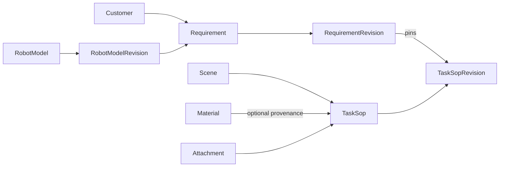

# SOP Proto v1alpha1

## Scope

`coscene.sop.v1alpha1` is the source of truth for the normalized SOP domain model. The existing YAML files were used only to discover business concepts; this schema does not preserve their field names or document shapes.

The application validates ProtoJSON with Protovalidate and persists each catalog resource, current resource, immutable revision, reviewed dependency, and sealed export bundle as an independent D1 record. D1 query columns are projections of the Proto messages, not a second domain definition. Confirmed revisions export through the separate `coscene.sop.export.v1alpha1` contract. Service RPCs and YAML import remain intentionally out of scope.

The deterministic legacy converter is operator-only bootstrap code for repository fixtures. Runtime requests never read fixture files, `app_data`, a site-wide snapshot, or a fallback exporter. Browser forms and REST DTOs are boundary mappings over the same generated Proto contract.

## Decisions

### Resource scope

v1alpha1 assumes one flat, single-tenant namespace because the current application has no project or organization parent. Resource names are:

```text
customers/{customer}
materials/{material}
scenes/{scene}
robotModels/{robot_model}
robotModels/{robot_model}/revisions/{revision}
attachments/{attachment}
taskSops/{task_sop}
taskSops/{task_sop}/revisions/{revision}
requirements/{requirement}
requirements/{requirement}/revisions/{revision}
```

If the production API is project-scoped, that parent must be introduced before v1 rather than prepended after clients depend on these names.

### Resource identity

- `name` is the canonical relative resource name.
- `uid` is an immutable, server-generated UUID.
- `display_name` is human-readable and may change without changing identity.
- Local list members use stable kebab-case `id` values.
- Resource references always contain full relative resource names; display text is never a reference.

### Revisions

Revisions follow the AIP-162 snapshot model. `RobotModelRevision.snapshot`, `TaskSopRevision.snapshot`, and `RequirementRevision.snapshot` contain the full parent resource representation at the time the revision was created. A revision is immutable.

Revision creation is explicit: editing a draft changes the working resource, while `CreateRevision` allocates a revision name, constructs the parent with that `current_revision`, snapshots that exact representation, and persists both atomically. `Confirm` performs the same atomic operation with the final parent representation already set to `lifecycle = CONFIRMED`; it never snapshots a draft and mutates it afterward. `current_revision` may therefore lag behind an edited working draft, but a confirmed resource exactly matches its current snapshot.

Updates to a confirmed resource are rejected. `StartDraft` copies the current confirmed snapshot into the working resource, changes its lifecycle to `DRAFT`, and leaves `current_revision` pinned to the last confirmed snapshot until the next revision is created. This prevents editing confirmed content in place while keeping a single stable parent resource name.

The canonical revision resource ID is server-generated and opaque. `version_label` is the single human-facing version in `MAJOR.MINOR.PATCH` numeric form, for example `0.0.4`; it is unique within its parent. During v1alpha1 the service increments the patch component for each explicit revision and reserves major/minor changes for a later compatibility policy. YAML uses `version_label` for display and the full revision resource `name` for references.

A `Requirement` production item is pinned to a `TaskSopRevision`, never to a mutable `TaskSop` or an implicit latest version.

Requirements also pin a `RobotModelRevision`, so later topic edits cannot change the meaning of an immutable requirement snapshot.

### Task objects

All objects participating in a task are declared in `TaskSopSpec.objects`. This includes manipulated materials and reference objects such as a washbasin, storage cup, or box.

Object state, reference paths, and randomization rules use the task-local object ID. Task-specific attributes are frozen in the revision snapshot; an optional `Material` reference records catalog provenance without making a mutable display name part of task identity.

### Controlled and open vocabularies

Schema-controlled lifecycle and change-frequency values are Proto enums. Business vocabularies that are expected to evolve independently—pose, form, region, support surface, material role, annotation type, delivery format, and atomic skill—remain stable strings or resource/local references in v1alpha1. UI localization must not change serialized protocol values.

### Presence and empty values

- Omitted optional fields mean unspecified.
- Empty strings and placeholder text such as `待填写` are not missing-value encodings.
- Optional numeric fields distinguish an explicit zero from an unspecified value.
- Quantity uses `oneof` so fixed and range values cannot coexist.
- Repeated fields represent an actual collection; slash-delimited multi-values are not supported.

## Resource graph



## Validation boundary

Protovalidate enforces local structural rules such as populated resource-name/reference formats, required message presence, enum membership, quantity exclusivity, ranges, URI/email formats, and stable local-ID syntax. `google.api.field_behavior` and `resource_reference` remain API metadata; explicit Protovalidate rules perform the actual structural validation. Output-only and identifier fields may be absent in input messages but are validated when populated.

Draft resources may be structurally incomplete: zero-valued UI placeholders are omitted rather than serialized as meaningful values. Completeness is lifecycle-dependent and is enforced atomically by `Confirm`, not by making every nested draft field unconditionally required.

The service layer must additionally validate rules that require graph or collection context:

- `TaskObject.id`, step IDs, rule IDs, and production item IDs are unique in their owner;
- every object-state, reference-path, and randomization object ID exists;
- initial and target state entries have unique object IDs, and confirmed SOPs cover every object required by the task outcome;
- every `TopicBinding.id` is unique in a RobotModel revision and every `TopicRequirement.topic_id` resolves in the pinned `RobotModelRevision.snapshot`;
- confirmation requires complete SOP object/robot/operation/annotation state and complete Requirement customer, robot, priority, deadline, production-item, and positive workload fields;
- revision snapshot names and `previous_revision` references share the same parent as the revision;
- every resource reference exists and points to an allowed lifecycle/revision;
- a Requirement can only be confirmed when all pinned SOP revisions are confirmed;
- attachment references are structurally valid; this release intentionally performs no live R2, URL reachability, hash, size, retention, or cleanup validation during confirmation/export;
- workload totals and other cross-item business constraints are consistent.

## Runtime and persistence boundary

The implemented runtime follows these rules:

1. generated TypeScript plus strict ProtoJSON decoding and validation;
2. resource-scoped D1 records with optimistic concurrency per mutable resource;
3. one current editable TaskSop/Requirement draft and immutable confirmed revisions;
4. read-only imported legacy draft checkpoints that cannot be selected, confirmed, or exported;
5. atomic root confirmation that writes one revision, one sealed bundle, and the current pointer;
6. browser summary pagination plus on-demand detail reads through resource routes;
7. confirmed-only, bundle-backed YAML and versioned PDF rendering with traceable identity;
8. bounded R2 attachment upload with D1 metadata and no lifecycle cleanup in this release.

`data/*.json` and the converter under `server/bootstrap/` are allowed only in the explicit operator bootstrap. A fresh environment transitions its fixed release marker from `EMPTY` to `IN_PROGRESS` to `COMPLETE`; normal reads remain blocked until the exact `COMPLETE` marker and projection audit pass. There is no online old-format migration, namespace activation, dual write, rollback adapter, canonical-data endpoint, or whole-site persistence row.

## Deployment order

This repository has not entered production and intentionally initializes a fresh D1 database:

1. review the fixed release manifest and dry-run fixture conversion;
2. apply `migrations/` to the environment's empty D1 database;
3. run the operator bootstrap for that D1 database;
4. require the exact readiness marker and integrity audit;
5. deploy Pages and verify resource, revision, attachment, and frozen-export flows;
6. restart without bootstrap and verify the same persisted records.

Exact commands and D1 Time Travel recovery are documented in [`operations/deployment-and-recovery.md`](operations/deployment-and-recovery.md).

## Verification

Run:

```text
pnpm proto:check
pnpm proto:drift
pnpm verify
pnpm test:e2e
pnpm test:e2e:pages
```

The repository installs the official `@bufbuild/buf` CLI at the pinned version `1.71.0`, so `pnpm install` provisions the same tool locally and in CI/deployment environments. `pnpm build` also runs the non-mutating Proto checks so deployment cannot bypass them.

For later schema changes, run `pnpm proto:breaking` against the accepted baseline before merging. The YAML contract evolves independently according to [`yaml-export-v1.md`](yaml-export-v1.md).
