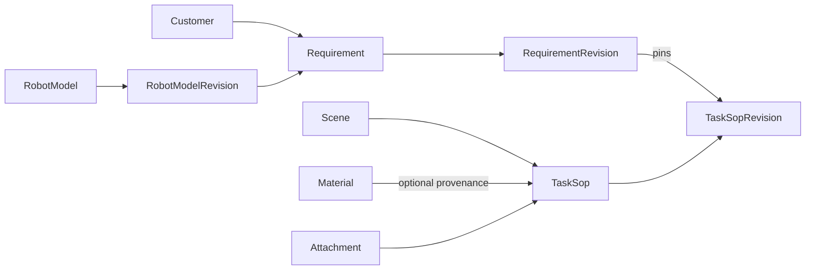

# SOP Proto v1alpha1

## Scope

`coscene.sop.v1alpha1` is the source of truth for the normalized SOP domain model. The existing YAML files were used only to discover business concepts; this schema does not preserve their field names or document shapes.

The application now stores canonical Proto snapshots behind namespace/epoch concurrency control, validates decoded ProtoJSON with Protovalidate, serves canonical data to the browser, and exports confirmed revisions through the separate `coscene.sop.export.v1alpha1` contract. Service RPCs and YAML import remain intentionally out of scope.

The existing REST route shapes, `shared/transport/restDto.ts`, `data/*.json`, D1 `app_data`, the deterministic legacy converter, and the old exporter fallback are temporary compatibility/rollback boundaries. They are not alternative domain authorities and are removed only after the production rollback window closes.

## Decisions

### Resource scope

v1alpha1 assumes one flat, single-tenant namespace because the current application has no project or organization parent. Resource names are:

```text
customers/{customer}
materials/{material}
scenes/{scene}
robotModels/{robot_model}
robotModels/{robot_model}/revisions/{revision}
attachments/{attachment}
taskSops/{task_sop}
taskSops/{task_sop}/revisions/{revision}
requirements/{requirement}
requirements/{requirement}/revisions/{revision}
```

If the production API is project-scoped, that parent must be introduced before v1 rather than prepended after clients depend on these names.

### Resource identity

- `name` is the canonical relative resource name.
- `uid` is an immutable, server-generated UUID.
- `display_name` is human-readable and may change without changing identity.
- Local list members use stable kebab-case `id` values.
- Resource references always contain full relative resource names; display text is never a reference.

### Revisions

Revisions follow the AIP-162 snapshot model. `RobotModelRevision.snapshot`, `TaskSopRevision.snapshot`, and `RequirementRevision.snapshot` contain the full parent resource representation at the time the revision was created. A revision is immutable.

Revision creation is explicit: editing a draft changes the working resource, while `CreateRevision` allocates a revision name, constructs the parent with that `current_revision`, snapshots that exact representation, and persists both atomically. `Confirm` performs the same atomic operation with the final parent representation already set to `lifecycle = CONFIRMED`; it never snapshots a draft and mutates it afterward. `current_revision` may therefore lag behind an edited working draft, but a confirmed resource exactly matches its current snapshot.

Updates to a confirmed resource are rejected. `StartDraft` copies the current confirmed snapshot into the working resource, changes its lifecycle to `DRAFT`, and leaves `current_revision` pinned to the last confirmed snapshot until the next revision is created. This prevents editing confirmed content in place while keeping a single stable parent resource name.

The canonical revision resource ID is server-generated and opaque. `version_label` is the single human-facing version in `MAJOR.MINOR.PATCH` numeric form, for example `0.0.4`; it is unique within its parent. During v1alpha1 the service increments the patch component for each explicit revision and reserves major/minor changes for a later compatibility policy. YAML uses `version_label` for display and the full revision resource `name` for references.

A `Requirement` production item is pinned to a `TaskSopRevision`, never to a mutable `TaskSop` or an implicit latest version.

Requirements also pin a `RobotModelRevision`, so later topic edits cannot change the meaning of an immutable requirement snapshot.

### Task objects

All objects participating in a task are declared in `TaskSopSpec.objects`. This includes manipulated materials and reference objects such as a washbasin, storage cup, or box.

Object state, reference paths, and randomization rules use the task-local object ID. Task-specific attributes are frozen in the revision snapshot; an optional `Material` reference records catalog provenance without making a mutable display name part of task identity.

### Controlled and open vocabularies

Schema-controlled lifecycle and change-frequency values are Proto enums. Business vocabularies that are expected to evolve independently—pose, form, region, support surface, material role, annotation type, delivery format, and atomic skill—remain stable strings or resource/local references in v1alpha1. UI localization must not change serialized protocol values.

### Presence and empty values

- Omitted optional fields mean unspecified.
- Empty strings and placeholder text such as `待填写` are not missing-value encodings.
- Optional numeric fields distinguish an explicit zero from an unspecified value.
- Quantity uses `oneof` so fixed and range values cannot coexist.
- Repeated fields represent an actual collection; slash-delimited multi-values are not supported.

## Resource graph



## Validation boundary

Protovalidate enforces local structural rules such as populated resource-name/reference formats, required message presence, enum membership, quantity exclusivity, ranges, URI/email formats, and stable local-ID syntax. `google.api.field_behavior` and `resource_reference` remain API metadata; explicit Protovalidate rules perform the actual structural validation. Output-only and identifier fields may be absent in input messages but are validated when populated.

Draft resources may be structurally incomplete: zero-valued UI placeholders are omitted rather than serialized as meaningful values. Completeness is lifecycle-dependent and is enforced atomically by `Confirm`, not by making every nested draft field unconditionally required.

The service layer must additionally validate rules that require graph or collection context:

- `TaskObject.id`, step IDs, rule IDs, and production item IDs are unique in their owner;
- every object-state, reference-path, and randomization object ID exists;
- initial and target state entries have unique object IDs, and confirmed SOPs cover every object required by the task outcome;
- every `TopicBinding.id` is unique in a RobotModel revision and every `TopicRequirement.topic_id` resolves in the pinned `RobotModelRevision.snapshot`;
- confirmation requires complete SOP object/robot/operation/annotation state and complete Requirement customer, robot, priority, deadline, production-item, and positive workload fields;
- revision snapshot names and `previous_revision` references share the same parent as the revision;
- every resource reference exists and points to an allowed lifecycle/revision;
- a Requirement can only be confirmed when all pinned SOP revisions are confirmed;
- attachment and catalog resources referenced by immutable revisions satisfy retention policy;
- workload totals and other cross-item business constraints are consistent.

## Implementation and remaining migration boundary

Completed:

1. generated TypeScript and strict runtime validation;
2. deterministic, resumable legacy conversion with reconciliation reports and stable identity;
3. canonical file/D1 namespaces with epoch fencing, atomic commits and write freeze/reopen;
4. canonical revision and attachment lifecycle services;
5. browser reads from `/api/canonical-data` and strict ProtoJSON decoding before projection to form view models;
6. confirmed-only Proto-backed YAML bundle export with deterministic serialization and traceable identity;
7. removal of the old `src/types.ts` shared-domain barrel.

Intentionally retained during rollout:

- existing REST mutation routes and form DTOs;
- `shared/transport/restDto.ts` as the transport-only type boundary;
- the deterministic converter in the live mutation adapter;
- `data/*.json` and D1 `app_data` as bootstrap/rollback inputs;
- legacy exporter utilities used by compatibility tests/fallback paths;
- current local/R2/S3 attachment transports.

The largest remaining contraction is the write path: it currently projects Proto to REST DTO, applies the existing route mutation, then converts and validates the result back into Proto. A later change should make commands mutate canonical resources directly. Compatibility storage and converter deletion must wait until that work is deployed and the production rollback window is explicitly closed.

## Rollout order

Steps 1–6 below are implemented in this branch; step 7 requires a controlled production operation:

1. approve v1alpha1 resources and semantics;
2. generate and validate Proto;
3. build deterministic seed/live-data generations with ambiguity reporting;
4. persist canonical resources and immutable revisions behind `AppStore`;
5. move runtime reads, lifecycle rules, attachment reachability and export to canonical services;
6. move browser reads to canonical Proto data and keep forms behind explicit view-model mappings;
7. prepare, freeze, explicitly activate, smoke-test and reopen the production namespace according to [`storage-migration-v1alpha1.md`](storage-migration-v1alpha1.md), then close the rollback window before deleting adapters.

## Verification

Run:

```text
pnpm proto:format
pnpm proto:check
```

The repository installs the official `@bufbuild/buf` CLI at the pinned version `1.71.0`, so `pnpm install` provisions the same tool locally and in CI/deployment environments. `pnpm build` also runs the non-mutating Proto checks so deployment cannot bypass them.

For later schema changes, run `pnpm proto:breaking` against the accepted baseline before merging. The YAML contract evolves independently according to [`yaml-export-v1.md`](yaml-export-v1.md).
