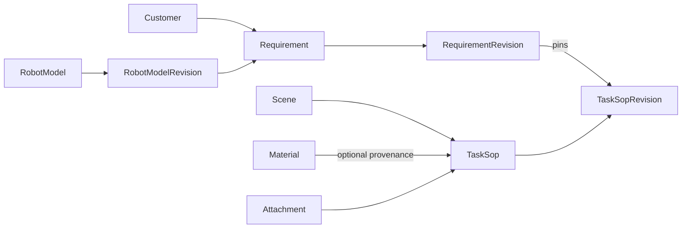

# SOP Proto v1alpha1

## Scope

`coscene.sop.v1alpha1` is the source of truth for the normalized SOP domain model. The existing YAML files were used only to discover business concepts; this schema does not preserve their field names or document shapes.

This first change defines resource messages and validation only. It deliberately does not:

- replace the current TypeScript runtime model;
- migrate persisted JSON or D1 values;
- define service RPCs;
- define the new YAML manifest envelope;
- read or write the legacy YAML schemas.

## Decisions

### Resource scope

v1alpha1 assumes one flat, single-tenant namespace because the current application has no project or organization parent. Resource names are:

```text
customers/{customer}
materials/{material}
scenes/{scene}
robotModels/{robot_model}
robotModels/{robot_model}/revisions/{revision}
attachments/{attachment}
taskSops/{task_sop}
taskSops/{task_sop}/revisions/{revision}
requirements/{requirement}
requirements/{requirement}/revisions/{revision}
```

If the production API is project-scoped, that parent must be introduced before v1 rather than prepended after clients depend on these names.

### Resource identity

- `name` is the canonical relative resource name.
- `uid` is an immutable, server-generated UUID.
- `display_name` is human-readable and may change without changing identity.
- Local list members use stable kebab-case `id` values.
- Resource references always contain full relative resource names; display text is never a reference.

### Revisions

Revisions follow the AIP-162 snapshot model. `RobotModelRevision.snapshot`, `TaskSopRevision.snapshot`, and `RequirementRevision.snapshot` contain the full parent resource representation at the time the revision was created. A revision is immutable.

Revision creation is explicit: editing a draft changes the working resource, while `CreateRevision` allocates a revision name, constructs the parent with that `current_revision`, snapshots that exact representation, and persists both atomically. `Confirm` performs the same atomic operation with the final parent representation already set to `lifecycle = CONFIRMED`; it never snapshots a draft and mutates it afterward. `current_revision` may therefore lag behind an edited working draft, but a confirmed resource exactly matches its current snapshot.

Updates to a confirmed resource are rejected. `StartDraft` copies the current confirmed snapshot into the working resource, changes its lifecycle to `DRAFT`, and leaves `current_revision` pinned to the last confirmed snapshot until the next revision is created. This prevents editing confirmed content in place while keeping a single stable parent resource name.

The canonical revision resource ID is server-generated and opaque. `version_label` is the single human-facing version in `MAJOR.MINOR.PATCH` numeric form, for example `0.0.4`; it is unique within its parent. During v1alpha1 the service increments the patch component for each explicit revision and reserves major/minor changes for a later compatibility policy. YAML uses `version_label` for display and the full revision resource `name` for references.

A `Requirement` production item is pinned to a `TaskSopRevision`, never to a mutable `TaskSop` or an implicit latest version.

Requirements also pin a `RobotModelRevision`, so later topic edits cannot change the meaning of an immutable requirement snapshot.

### Task objects

All objects participating in a task are declared in `TaskSopSpec.objects`. This includes manipulated materials and reference objects such as a washbasin, storage cup, or box.

Object state, reference paths, and randomization rules use the task-local object ID. Task-specific attributes are frozen in the revision snapshot; an optional `Material` reference records catalog provenance without making a mutable display name part of task identity.

### Controlled and open vocabularies

Schema-controlled lifecycle and change-frequency values are Proto enums. Business vocabularies that are expected to evolve independently—pose, form, region, support surface, material role, annotation type, delivery format, and atomic skill—remain stable strings or resource/local references in v1alpha1. UI localization must not change serialized protocol values.

### Presence and empty values

- Omitted optional fields mean unspecified.
- Empty strings and placeholder text such as `待填写` are not missing-value encodings.
- Optional numeric fields distinguish an explicit zero from an unspecified value.
- Quantity uses `oneof` so fixed and range values cannot coexist.
- Repeated fields represent an actual collection; slash-delimited multi-values are not supported.

## Resource graph



## Validation boundary

Protovalidate enforces local structural rules such as populated resource-name/reference formats, required message presence, enum membership, quantity exclusivity, ranges, URI/email formats, and stable local-ID syntax. `google.api.field_behavior` and `resource_reference` remain API metadata; explicit Protovalidate rules perform the actual structural validation. Output-only and identifier fields may be absent in input messages but are validated when populated.

Draft resources may be structurally incomplete: zero-valued UI placeholders are omitted rather than serialized as meaningful values. Completeness is lifecycle-dependent and is enforced atomically by `Confirm`, not by making every nested draft field unconditionally required.

The service layer must additionally validate rules that require graph or collection context:

- `TaskObject.id`, step IDs, rule IDs, and production item IDs are unique in their owner;
- every object-state, reference-path, and randomization object ID exists;
- initial and target state entries have unique object IDs, and confirmed SOPs cover every object required by the task outcome;
- every `TopicBinding.id` is unique in a RobotModel revision and every `TopicRequirement.topic_id` resolves in the pinned `RobotModelRevision.snapshot`;
- confirmation requires complete SOP object/robot/operation/annotation state and complete Requirement customer, robot, priority, deadline, production-item, and positive workload fields;
- revision snapshot names and `previous_revision` references share the same parent as the revision;
- every resource reference exists and points to an allowed lifecycle/revision;
- a Requirement can only be confirmed when all pinned SOP revisions are confirmed;
- attachment and catalog resources referenced by immutable revisions satisfy retention policy;
- workload totals and other cross-item business constraints are consistent.

## Does the current implementation need migration?

Yes. Defining Proto does not require an immediate runtime change, but using it as the system contract requires a model migration rather than a serializer-only replacement.

### Must migrate

1. `src/types.ts`: replace the nested `Scene -> Subscene -> versions` and `Requirement -> versions` domain model with generated Proto types or thin application types derived from them.
2. `server/versioning.ts` and duplicated ID logic: replace patch-string versions and short hashes with persisted resource names, UUIDs, immutable revision resources, and the deterministic `version_label` policy above.
3. Requirement-to-SOP resolution: replace scene/title/version matching with a direct `TaskSopRevision.name` reference.
4. `server/yamlExport.ts`: replace manual casing, localized enum values, derived config versions, and embedded SOP details with the later Proto-backed manifest serializer.
5. Persisted `data/*.json` and deployed D1 `app_data` values: perform a one-time conversion or explicitly reset them. Ignoring legacy YAML does not remove the need to migrate live stored data.
6. `src/App.tsx`: eventually replace old DTOs, name-based lookup, and duplicated version/hash logic with generated types and canonical references.

### Can remain during the transition

- Existing HTTP routes may initially remain as compatibility endpoints around a server-side adapter.
- `AppStore` remains a useful seam between API handlers and storage.
- Local JSON files and the D1 key/value table can store new resource collections before any relational database redesign.
- R2/S3/local attachment transports can remain; only attachment identity and ownership metadata need to change.
- Existing UI forms may temporarily consume a compatibility DTO while the service stores normalized resources.

The adapter is temporary. It should be removed after the frontend, API handlers, persistence, and YAML exporter all use the Proto-first model.

## Recommended migration order

1. Review and approve these v1alpha1 resources and semantics.
2. Add TypeScript code generation and runtime validation.
3. Implement a deterministic seed/live-data converter with ambiguity reporting. The converter must create an initial `RobotModelRevision`, retain requirement priority and aggregate workload, and map step randomization plus annotation readiness/note/action tags.
4. Persist stable resources and revisions behind `AppStore`.
5. Migrate API handlers from names and version labels to resource references.
6. Define the YAML manifest Proto and ProtoJSON-compatible YAML representation.
7. Replace the exporter, then migrate the frontend and delete the temporary adapter.

## Verification

Run:

```text
pnpm proto:format
pnpm proto:check
```

The repository installs the official `@bufbuild/buf` CLI at the pinned version `1.71.0`, so `pnpm install` provisions the same tool locally and in CI/deployment environments. `pnpm build` also runs the non-mutating Proto checks so deployment cannot bypass them.

For later schema changes, compare against the accepted baseline with `buf breaking` before merging.
